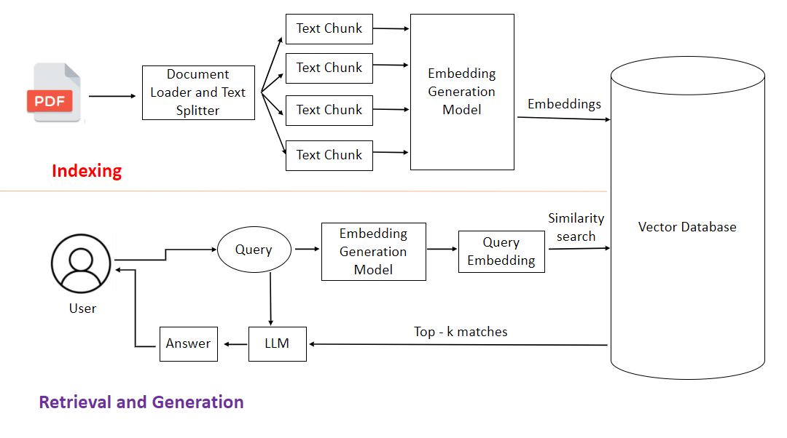

# LangChain

LangChain is a powerful framework designed to build applications with large language models (LLMs) using composable components.

## 🔍 Key Component: RAG (Retrieval-Augmented Generation)

RAG enhances the capability of LLMs by integrating external knowledge sources. Instead of relying solely on pre-trained knowledge, the model retrieves relevant context to generate more accurate and up-to-date responses.

 

### 🧠 How RAG Works

The RAG pipeline consists of the following steps:

| Step                          | Description                                                                                  |
|-------------------------------|----------------------------------------------------------------------------------------------|
| 1. Data Ingestion             | Load data from sources like PDFs, Word documents, etc. (using LangChain tools).              |
| 2. Chunking                   | Split large documents into smaller text chunks to respect LLM context length limits.         |
| 3. Embedding Generation       | Convert text chunks into vector representations using text embeddings.                      |
| 4. Vector Storage             | Store the vector embeddings in a vector database such as FAISS, ChromaDB, or AstraDB.        |
| 5. Context Retrieval          | Use a retrieval chain to fetch contextually relevant chunks from the vector database.        |
| 6. Response Generation        | Pass the retrieved context to the LLM to generate a final answer to the user prompt.         |

### 🗂 Workflow Overview

Here's a visual representation of the RAG process:

---